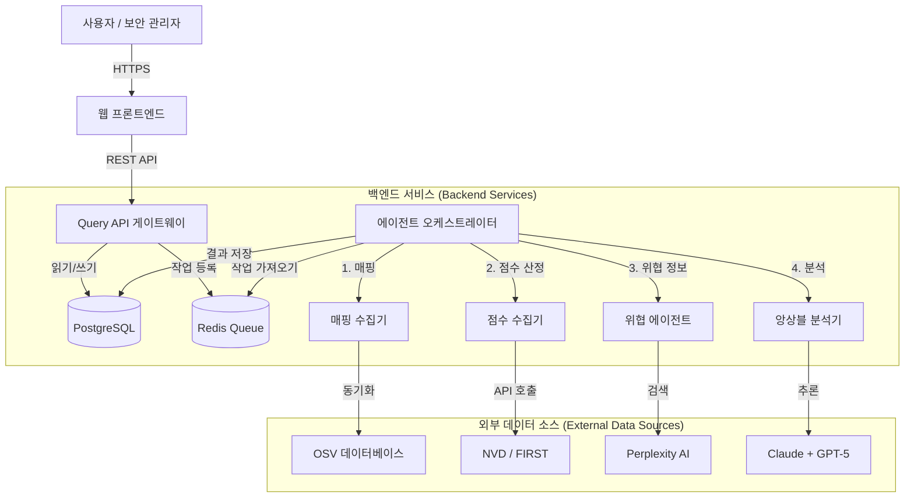

# 상세 시스템 설계 및 구현 보고서

## 1. 서론 (Introduction)

### 1.1 프로젝트 개요
소프트웨어 공급망 공격이 급증함에 따라 오픈소스 패키지 보안은 선택이 아닌 필수가 되었습니다. 기존의 단순 CVE 조회 방식은 파편화된 정보와 맥락 부재로 인해 신속한 의사결정을 저해합니다. 이에 따라 이기종 생태계를 아우르는 통합 위협 인텔리전스 플랫폼의 필요성이 대두되었습니다.

### 1.2 개발 목표
본 프로젝트는 **Multi-Ecosystem Threat Intelligence Platform**을 구축하여 다음 세 가지 핵심 가치를 실현했습니다.
1.  **통합 가시성**: NPM, PyPI, APT 등 파편화된 패키지 생태계의 보안 위협을 단일 대시보드로 통합했습니다.
2.  **정밀 분석**: 생성형 AI 앙상블(Ensemble) 기술로 취약점의 실질적 위험도를 평가하고 오탐(False Positive)을 최소화했습니다.
3.  **실질적 대응**: 기업 기술 스택에 최적화된 구체적인 대응 가이드를 제공하여 보안 조치 시간을 획기적으로 단축했습니다.

### 1.3 시스템 범위
- **지원 생태계**: Node.js (npm), Python (pip), Debian/Ubuntu (apt)
- **주요 기능**: 취약점 자동 수집, 정량적/정성적 위험도 평가, AI 기반 대응 방안 생성, 통합 대시보드

### 1.4 팀 구성 및 역할 (Team Roles)

본 프로젝트는 각 팀원의 전문성을 살려 유기적인 협업을 통해 진행되었습니다.

| 이름 | 역할 | 주요 수행 내용 |    
| :--- | :--- | :--- |
| **권호영** (팀장) | **PM / Lead Architect** | • **전체 시스템 아키텍처(MSA) 설계 및 총괄** • **AI 앙상블 분석 엔진(Claude+GPT-5) 및 환각 방지 로직 핵심 구현** • 비동기 오케스트레이터(Agent Orchestrator) 및 장애 격리(DLQ) 메커니즘 개발 • 대용량 트래픽 처리를 위한 DB 스키마 최적화 및 인덱싱 전략 수립 |
| **박규태** | Backend Engineer | • **Query API 게이트웨이 개발** 및 요청 검증(Pydantic) 로직 구현 • Redis 기반의 **Multi-Level Caching 전략** 설계 및 적용 • 오픈소스 취약점 데이터베이스(OSV) 연동 및 매핑 수집기(Mapping Collector) 개발 |
| **박수현** | AI/Data Engineer | • **위협 인텔리전스 수집기(Threat Agent)** 개발 및 Perplexity AI 연동 • 정량적 위험도 평가를 위한 **NVD/EPSS 점수 수집 파이프라인** 구축 • LLM 프롬프트 엔지니어링 및 생태계별 분석 컨텍스트 최적화 |
| **한승호** | Frontend / DevOps | • **통합 보안 대시보드(Web Frontend)** 설계 및 React 기반 구현 • 데이터 시각화(Recharts) 및 실시간 상태 관리(React Query) 적용 • **Docker Compose 기반 컨테이너 오케스트레이션** 환경 구축 및 배포 자동화 |

---

## 2. 시스템 아키텍처 (System Architecture)

### 2.1 전체 아키텍처 조감도
확장성과 유연성을 위해 **마이크로서비스 아키텍처(MSA)**를 기반으로 5계층(Input, Collection, Analysis, Storage, Output) 구조를 설계했습니다.

### 2.2 모듈별 상세 명세 (Module Specifications)

각 마이크로서비스의 핵심 기능과 구현 로직은 다음과 같습니다.

#### 1) Web Frontend (`web-frontend`)
사용자와 시스템 간의 상호작용을 담당하는 인터페이스입니다.
- **기술 스택**: React 18, TypeScript, Vite, TailwindCSS, Recharts
- **주요 기능**:
    - **실시간 대시보드**: `Recharts` 라이브러리를 활용하여 생태계별 위험도 분포를 시각화합니다.
    - **상태 관리**: `React Query`를 사용하여 서버 상태를 효율적으로 관리하고, 폴링(Polling) 간격을 최적화합니다.
    - **리포트 뷰어**: `react-markdown`을 통해 AI가 생성한 마크다운 형식의 분석 보고서를 렌더링합니다.

#### 2) Query API Gateway (`query-api`)
모든 외부 요청을 처리하는 진입점입니다.
- **기술 스택**: FastAPI, Uvicorn, Pydantic, Redis
- **주요 기능**:
    - **요청 검증**: `Pydantic` 모델을 사용하여 입력값(패키지명, 버전, 생태계)의 유효성을 엄격하게 검사합니다.
    - **캐싱 전략**: Redis를 조회하여 분석 완료된 데이터가 있을 경우 DB 조회 없이 즉시 반환(Cache Hit)합니다.
    - **작업 라우팅**: 분석이 필요한 경우, 요청 정보를 직렬화하여 Redis Queue(`analysis_tasks`)로 전송합니다.

#### 3) Agent Orchestrator (`agent-orchestrator`)
백그라운드에서 분석 파이프라인을 제어하는 워커 프로세스입니다.
- **기술 스택**: Python Asyncio, Redis-py
- **주요 기능**:
    - **작업 소비**: `BLPOP` 명령어로 큐에서 작업을 가져와 비동기적으로 처리합니다.
    - **파이프라인 관리**: `Mapping` -> `Scoring` -> `Threat Intel` -> `Analysis` 순서로 하위 서비스들을 호출하고 데이터를 취합합니다.
    - **장애 격리**: 처리 중 예외 발생 시 재시도(Retry) 후 실패하면 DLQ로 이동시켜 시스템 전체의 안정성을 보장합니다.

#### 4) Mapping Collector (`mapping-collector`)
취약점 데이터베이스와 패키지 정보를 매핑합니다.
- **기술 스택**: FastAPI, httpx
- **주요 기능**:
    - **OSV 연동**: Google의 OSV API를 호출하여 패키지 버전별 CVE ID를 조회합니다.
    - **버전 매칭**: `packaging` (Python) 및 `semver` (Node.js) 라이브러리를 활용하여 복잡한 버전 범위(Range) 연산을 수행합니다.

#### 5) Ensemble Analyzer (`analyzer`)
AI 모델을 활용하여 최종 위험도를 평가합니다.
- **기술 스택**: FastAPI, OpenAI API, Anthropic API
- **주요 기능**:
    - **프롬프트 엔지니어링**: 수집된 정량/정성 데이터를 구조화된 프롬프트로 변환하여 LLM에 전달합니다.
    - **앙상블 로직**: Claude와 GPT-5의 응답을 파싱하고, 결과가 상이할 경우 신뢰도 점수를 계산하여 최종 결론을 도출합니다.
    - **검증(Validation)**: 생성된 JSON 응답의 스키마를 검증하고, 필수 필드 누락 시 재생성을 요청합니다.

### 2.3 기술 스택 (Tech Stack)
- **Backend**: Python 3.11+, FastAPI, Asyncio (고성능 비동기 처리)
- **Frontend**: React 18, TypeScript, Vite, TailwindCSS (모던 웹 환경)
- **AI Engine**: Claude haiku 4.5 (주 분석), GPT-5.1 (검증), Perplexity (위협 정보)
- **Infrastructure**: Docker Compose (오케스트레이션), PostgreSQL 15 (데이터 저장), Redis 7 (큐/캐시)

### 2.4 시스템 동작 흐름 (System Operation Flow)

패키지 분석 요청 시 시스템 내부의 데이터 처리 파이프라인은 다음과 같이 동작합니다.

1.  **요청 및 검증 (Request & Validation)**
    - 사용자가 Frontend에서 패키지명(예: `flask`)과 생태계(예: `pip`)를 입력합니다.
    - **Query API**는 요청 파라미터를 검증하고, Redis 캐시를 조회합니다.
    - 캐시 미스(Cache Miss) 시, 분석 작업 객체를 생성하여 Redis Queue(`analysis_tasks`)에 적재(`RPUSH`)하고, 사용자에게는 `202 Accepted` 상태와 함께 폴링을 지시합니다.

2.  **비동기 작업 소비 (Async Job Consumption)**
    - **Agent Orchestrator**는 `BLPOP`으로 큐를 대기하다가 작업이 도착하면 즉시 가져옵니다.
    - 작업의 `ecosystem` 필드를 확인하여 적절한 분석 전략(Strategy)을 선택합니다.

3.  **데이터 수집 및 매핑 (Collection & Mapping)**
    - **Mapping Collector**를 호출하여 OSV DB에서 해당 패키지의 모든 취약점(CVE) 목록을 조회합니다.
    - 사용자가 지정한 버전(예: `2.0.0`)에 영향을 주는 CVE만 필터링합니다.

4.  **위험도 평가 및 인텔리전스 확보 (Scoring & Intelligence)**
    - **Score Fetchers**가 NVD와 FIRST에서 각 CVE의 CVSS, EPSS 점수를 병렬로 수집합니다.
    - **Threat Agent**는 Perplexity AI를 통해 해당 취약점의 실제 공격 사례(PoC, Exploit)를 웹에서 검색합니다.

5.  **AI 앙상블 분석 (AI Ensemble Analysis)**
    - 수집된 모든 정보(CVE 설명, 점수, 위협 정보)를 종합하여 프롬프트를 구성합니다.
    - **Claude**와 **GPT-5**가 각각 독립적으로 위험도를 분석하고 대응 방안을 생성합니다.
    - 두 모델의 결과를 비교 검증(Cross-Validation)하여 최종 리포트를 확정합니다.

6.  **저장 및 반환 (Storage & Response)**
    - 최종 분석 결과는 PostgreSQL(`analysis_results`)에 영구 저장되고, Redis 캐시에 등록됩니다.
    - Frontend는 폴링을 통해 분석 완료를 감지하고, 최종 결과를 사용자에게 시각화하여 보여줍니다.

---

## 3. 핵심 기능 및 구현 상세 (Core Implementation)

### 3.1 통합 분석 파이프라인 (Unified Pipeline)
이기종 생태계 데이터를 표준화된 포맷으로 정규화하여 처리합니다.
1.  **생태계 식별**: 요청된 `ecosystem` 파라미터(npm/pip/apt)를 기반으로 분석 컨텍스트를 설정합니다.
2.  **버전 정규화**: SemVer(npm), PEP 440(pip) 등 상이한 버전 체계를 내부 표준 포맷으로 변환하여 매핑 정확도를 높입니다.
3.  **데이터 통합**: OSV에서 수집한 매핑 정보와 NVD/FIRST의 정량적 점수를 결합하여 기초 데이터를 구성합니다.

### 3.2 AI 앙상블 분석 엔진 (Ensemble Engine)
단일 AI 모델의 편향성을 제거하고 정확도를 높이기 위해 **교차 검증(Cross-Validation)** 시스템을 구현했습니다.
- **Context-Aware Analysis**: 생태계별 특성을 프롬프트에 반영합니다.
    - *예: Python의 `pickle` 역직렬화 취약점은 RCE 위험이 매우 높음*
    - *예: Node.js의 `prototype pollution`은 DoS 또는 권한 상승으로 이어질 수 있음*
- **Consensus Algorithm**:
    - Claude와 GPT가 독립적으로 위험도를 평가합니다.
    - 두 결과의 일치도를 계산하여 합의 신뢰도(Consensus Confidence)를 산출합니다.
    - 신뢰도가 임계값(0.7) 미만일 경우, '불확실(Uncertain)' 플래그를 표시하고 재분석을 합니다.
- **Anti-Hallucination**: AI가 생성한 CVSS 점수나 벡터가 NVD 원천 데이터와 일치하는지 자동 검증하여 허위 정보 생성을 차단합니다.
### 3.3 AI 환각 방지 시스템 (Anti-Hallucination System)
생성형 AI의 환각(Hallucination) 현상을 방지하기 위해 3단계 검증 프로세스를 적용했습니다.

1.  **Fact Checking (사실 검증)**:
    - AI가 생성한 분석 결과 중 정량적 데이터(CVSS 점수, 벡터 등)를 NVD 원천 데이터와 실시간으로 대조합니다.
    - 불일치 발생 시 해당 분석을 '신뢰할 수 없음'으로 마킹하고 관리자에게 알림을 전송합니다.

2.  **Ensemble Consensus (앙상블 합의)**:
    - 주 분석 모델(Claude)과 검증 모델(GPT-5)이 독립적으로 도출한 결론을 비교합니다.
    - 두 모델의 의견이 일치하지 않을 경우, **합의 신뢰도(Consensus Confidence)** 점수를 낮게 책정하여 사용자에게 주의를 줍니다.

3.  **Hallucination Risk Scoring (환각 위험도 산정)**:
    - 분석 텍스트 내에 근거 없는 주장이나 모호한 표현이 포함되어 있는지 자연어 처리(NLP) 기법으로 탐지합니다.
    - 0.0(안전)에서 1.0(위험) 사이의 점수를 부여하여, 위험도가 높은 보고서는 자동으로 필터링합니다.

### 3.4 비동기 처리 (Async Processing)
- **Redis Queue**: 모든 분석 요청은 `analysis_tasks` 큐에 적재되어 순차적으로 처리됩니다. 이를 통해 트래픽 폭주 시에도 시스템 다운을 방지합니다.
- **Dead Letter Queue (DLQ)**: 분석 중 오류가 발생한 작업은 `analysis_tasks:failed` 큐로 격리됩니다. 이는 일시적인 오류로 인한 데이터 유실을 막고, 관리자가 추후 원인을 분석할 수 있게 합니다.

---

## 4. 데이터 모델링 (Data Modeling)

### 4.1 데이터베이스 스키마 설계
생태계 확장을 고려하여 유연한 스키마를 적용했습니다.

#### `package_cve_mapping` 테이블
| 컬럼명 | 타입 | 설명 |
| :--- | :--- | :--- |
| `id` | SERIAL | PK |
| `package` | TEXT | 패키지 이름 |
| `version_range` | TEXT | 영향받는 버전 범위 |
| `ecosystem` | TEXT | **생태계 구분 (npm, pip, apt)** |
| `cve_ids` | TEXT[] | 연관된 CVE ID 목록 |

### 4.2 데이터 격리 및 인덱싱
- **논리적 파티셔닝**: `ecosystem` 컬럼을 기준으로 인덱스를 생성하여, 특정 생태계 데이터 조회 시 스캔 범위를 최소화했습니다.
- **JSONB 활용**: `threat_cases` 테이블의 상세 위협 정보는 JSONB 타입으로 저장하여, 생태계별로 상이한 메타데이터 구조를 유연하게 수용합니다.

---

## 5. 인터페이스 설계 (Interface Design)

### 5.1 통합 API 명세
RESTful 원칙을 준수하며, 생태계 파라미터를 필수적으로 포함합니다.

- **GET /api/v1/query**
    - `package`: 패키지 이름 (예: `flask`)
    - `ecosystem`: 생태계 (예: `pip`)
    - `version`: 버전 (선택, 기본값 `latest`)
- **GET /api/v1/stats**
    - 생태계별 위험도 분포 통계 반환

### 5.2 사용자 경험 (UX)
- **통합 대시보드**: 전체 생태계의 보안 현황을 한눈에 파악할 수 있는 차트 제공
- **필터링**: 생태계별, 위험 등급별 필터링을 통해 관심 있는 정보에 집중 가능
- **상세 리포트**: Markdown 렌더링을 통해 가독성 높은 AI 분석 결과 제공

---

## 6. 시스템 사용 가이드 (System Usage Guide)

보안 담당자가 시스템을 활용하여 패키지 위협을 분석하는 절차는 다음과 같습니다.

### 6.1 대시보드 접속 및 현황 파악
1.  웹 브라우저를 열고 시스템 URL에 접속합니다.
2.  **메인 대시보드**에서 현재까지 수집된 생태계별(npm, pip, apt) 취약점 통계와 위험도 분포(Critical, High, Medium, Low)를 확인합니다.

### 6.2 패키지 분석 요청
1.  상단 검색바에 분석하고 싶은 **패키지 이름**(예: `axios`)을 입력합니다.
2.  우측 드롭다운 메뉴에서 해당 패키지의 **생태계**(예: `npm`)를 선택합니다.
3.  `Analyze` 버튼을 클릭하여 분석을 시작합니다.
    - *참고: 이미 분석된 패키지는 즉시 결과가 표시되며, 새로운 패키지는 약 1~2분의 분석 시간이 소요됩니다.*

### 6.3 분석 리포트 확인
분석이 완료되면 상세 리포트 페이지로 이동합니다.
- **Risk Score**: AI가 산정한 최종 위험 점수(0~100)와 등급을 확인합니다.
- **Vulnerability Details**: 발견된 CVE 목록과 각각의 CVSS/EPSS 점수를 검토합니다.
- **AI Analysis**: Claude와 GPT-5가 작성한 상세 분석 의견과 **대응 가이드(Mitigation Guide)**를 읽고 조치를 취합니다.

---

## 7. 시스템 성능 및 제한사항 (Performance & Limitations)

### 7.1 성능 목표 및 지표 (Performance Metrics)
- **분석 소요 시간**:
    - **Cache Hit**: 0.1초 이내 (즉시 반환)
    - **New Analysis**: 평균 60초 ~ 120초 (외부 API 응답 속도에 의존)
- **동시 처리 능력**:
    - Worker 인스턴스 당 10개의 동시 분석 작업 처리 가능 (AsyncIO 기반)
    - 트래픽 증가 시 Worker 컨테이너 수평 확장(Scale-out)으로 대응

### 7.2 알려진 제한사항 (Known Limitations)
- **API Rate Limit**: NVD 및 GitHub API의 호출 제한으로 인해, 단시간 대량 요청 시 분석이 지연될 수 있습니다. (지수 백오프 알고리즘으로 완화)
- **Public Package Only**: 현재 버전은 공개된 오픈소스 패키지(Public Registry)만 분석 가능하며, 사내 비공개 패키지(Private)는 지원하지 않습니다.
- **AI Context Window**: 분석할 취약점 정보가 너무 방대할 경우(수백 개의 CVE), AI 모델의 토큰 제한으로 인해 일부 정보가 요약되거나 생략될 수 있습니다.

---

## 8. 품질 및 안정성 (Quality & Reliability)

### 8.1 예외 처리 및 복구
- **Fallback Strategy**: NVD API 장애 시, Perplexity AI를 통해 최신 정보를 수집하거나 캐시된 데이터를 제공하여 서비스 연속성을 보장합니다.
- **Rate Limiting**: 외부 API 호출 시 토큰 버킷 알고리즘을 적용하여 호출 제한을 준수합니다.

### 8.2 보안 설계
- **Input Validation**: 생태계별 패키지 명명 규칙(Regex)을 적용하여 악의적인 입력(SQL Injection 등)을 차단합니다.
- **Network Isolation**: DB와 Redis는 외부 접근이 차단된 내부 Docker 네트워크에서만 통신합니다.

---

## 9. 향후 로드맵 (Future Roadmap)

본 프로젝트는 단순 모니터링 도구를 넘어, 전사적 보안 자동화 플랫폼으로의 진화를 목표로 합니다.

### Phase 1: 자동화 및 확장
- [ ] **CI/CD 파이프라인 연동**: GitHub Actions, Jenkins 플러그인 개발을 통해 코드 커밋 시점부터 취약점 차단 (Shift-Left Security)
- [ ] **사설 저장소(Private Registry) 지원**: 사내에서 자체 개발한 비공개 패키지에 대한 보안 분석 기능 추가
- [ ] **IDE 플러그인 출시**: 개발자가 코딩 중에 실시간으로 보안 가이드를 받을 수 있는 VS Code 확장 프로그램 배포

### Phase 2: 플랫폼화
- [ ] **SaaS 모델 확장**: 계열사 및 협력사에도 클라우드 기반으로 서비스를 제공하여 보안 생태계 확장
- [ ] **규제 준수 자동화**: ISMS-P, GDPR 등 주요 보안 컴플라이언스 리포트 자동 생성 기능

---

## 10. 결론 (Conclusion)

본 **Multi-Ecosystem Threat Intelligence Platform**은 오픈소스 패키지 보안 위협을 통합 관리하는 엔터프라이즈 솔루션입니다.

AI 앙상블 기술로 **분석 정확도를 극대화**하고, 자동화된 파이프라인을 통해 **보안 대응 시간을 최소화**했습니다. 향후 Maven, Go, Docker 등 지원 생태계를 지속적으로 확장하여, 소프트웨어 공급망 보안의 표준 플랫폼으로 자리 잡을 것입니다.

---

## 11. 용어 정의 (Glossary)

본 보고서에서 사용된 주요 기술 용어에 대한 설명입니다.

| 용어 | 설명 |
| :--- | :--- |
| **CVE (Common Vulnerabilities and Exposures)** | 소프트웨어 보안 취약점을 식별하기 위해 부여하는 고유 번호입니다. (예: CVE-2021-44228) |
| **CVSS (Common Vulnerability Scoring System)** | 취약점의 심각성을 0점부터 10점까지의 점수로 평가하는 국제 표준 시스템입니다. 점수가 높을수록 위험합니다. |
| **EPSS (Exploit Prediction Scoring System)** | 특정 취약점이 실제로 해커에 의해 악용될 확률을 예측한 점수입니다. |
| **MSA (Microservices Architecture)** | 거대한 시스템을 레고 블록처럼 작은 서비스 단위로 쪼개어 개발하고 운영하는 방식입니다. 유지보수와 확장이 쉽습니다. |
| **LLM (Large Language Model)** | 방대한 텍스트 데이터를 학습하여 사람처럼 글을 쓰고 이해할 수 있는 거대 인공지능 모델입니다. (예: GPT-4, Claude) |
| **Ensemble (앙상블)** | 여러 개의 AI 모델을 함께 사용하여, 혼자서 판단할 때보다 더 정확하고 신뢰할 수 있는 결과를 얻는 기법입니다. |
| **Hallucination (환각 현상)** | AI가 사실이 아닌 정보를 마치 사실인 것처럼 그럴듯하게 지어내는 현상을 말합니다. |
| **DLQ (Dead Letter Queue)** | 시스템에서 처리에 실패한 작업들을 버리지 않고 따로 모아두는 '재활용 쓰레기통' 같은 임시 저장소입니다. |
| **Polling (폴링)** | 클라이언트가 서버에게 "작업 다 됐나요?"라고 주기적으로 물어보는 통신 방식입니다. |
| **OSV (Open Source Vulnerabilities)** | 구글이 주도하는 오픈소스 소프트웨어 취약점 데이터베이스입니다. |

---

## 12. 참고문헌 (References)

1.  **OSV (Open Source Vulnerabilities)**: [https://osv.dev/](https://osv.dev/)
2.  **NVD (National Vulnerability Database)**: [https://nvd.nist.gov/](https://nvd.nist.gov/)
3.  **CVSS (Common Vulnerability Scoring System)**: [https://www.first.org/cvss/](https://www.first.org/cvss/)
4.  **EPSS (Exploit Prediction Scoring System)**: [https://www.first.org/epss/](https://www.first.org/epss/)
5.  **FastAPI Documentation**: [https://fastapi.tiangolo.com/](https://fastapi.tiangolo.com/)
6.  **React Documentation**: [https://react.dev/](https://react.dev/)
7.  **Anthropic Claude API**: [https://www.anthropic.com/api](https://www.anthropic.com/api)
8.  **OpenAI API**: [https://platform.openai.com/docs/overview](https://platform.openai.com/docs/overview)

### 12.1 학술 자료 (Academic References)

9.  **Jacobs, J., et al. (2021).** "Exploit Prediction Scoring System (EPSS)." *Digital Threats: Research and Practice*. (EPSS 방법론의 기초 연구)
10. **Ohm, M., et al. (2020).** "Backstabber’s Knife Collection: A Review of Open Source Software Supply Chain Attacks." *DIMVA*. (오픈소스 공급망 공격 유형 분류)
11. **Hou, X., et al. (2023).** "Large Language Models for Software Engineering: A Systematic Literature Review." *arXiv preprint*. (LLM의 소프트웨어 공학 적용 사례)
12. **OWASP.** "Top 10 for Large Language Model Applications." (LLM 애플리케이션 보안 표준)
