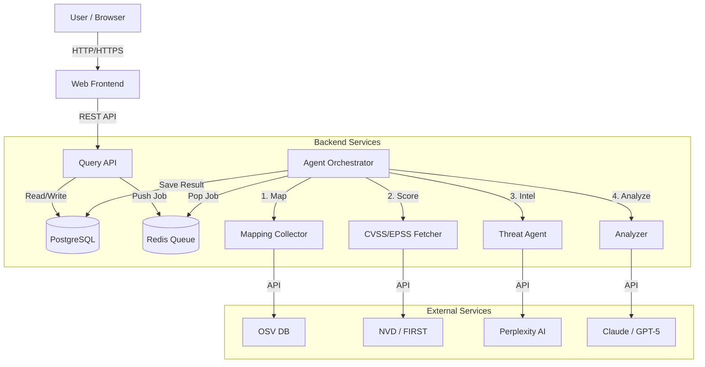

# 소프트웨어 설계 명세서 (Software Design Specification)

## 1. 시스템 아키텍처 (System Architecture)

본 시스템은 **마이크로서비스 아키텍처(MSA)**를 기반으로 하며, 각 서비스는 Docker 컨테이너로 격리되어 실행됩니다. 서비스 간 통신은 REST API(동기)와 Redis Message Queue(비동기)를 혼합하여 사용합니다.

### 1.1 아키텍처 다이어그램 (Conceptual)



---

## 2. 작동 순서 (Operation Sequence)

### 2.1 분석 요청 및 처리 흐름 (Analysis Request Flow)

사용자가 패키지 분석을 요청했을 때의 전체 처리 과정입니다.

1.  **요청 접수**: 사용자가 Frontend를 통해 패키지/CVE 분석 요청 (`GET /api/v1/query`)
2.  **캐시/DB 확인**: Query API가 Redis 캐시 및 PostgreSQL DB 조회
    *   *Hit*: 결과 즉시 반환
    *   *Miss*: 분석 작업 생성
3.  **작업 큐잉**: Query API가 분석 작업을 Redis Queue(`analysis_tasks`)에 적재 (`RPUSH`)
4.  **작업 수신**: 대기 중인 Agent Orchestrator(Worker)가 작업을 수신 (`BLPOP`)
5.  **파이프라인 실행**:
    *   **Mapping**: 패키지-CVE 매핑 정보 수집
    *   **Scoring**: CVSS/EPSS 점수 수집
    *   **Prioritization**: 위험도 기반 Top 10 선정
    *   **Threat Intel**: 실제 공격 사례 수집
    *   **AI Analysis**: Claude + GPT-5 앙상블 분석
6.  **결과 저장**: 최종 분석 결과를 PostgreSQL에 저장
7.  **결과 반환**: Frontend가 폴링(Polling)을 통해 DB에 저장된 결과를 확인하고 사용자에게 표시

---

## 3. 주요 모듈 (Major Modules)

### 3.1 Query API (`query_api`)
시스템의 진입점(Entry Point) 역할을 수행합니다.
*   **API Gateway**: 모든 클라이언트 요청을 처리하고 검증합니다.
*   **Polling Handler**: 비동기 분석 작업의 완료 여부를 확인하는 폴링 메커니즘을 제공합니다.
*   **Cache Manager**: Redis를 활용한 응답 캐싱 전략을 관리합니다.

### 3.2 Agent Orchestrator (`agent_orchestrator`)
백그라운드에서 실제 분석을 수행하는 워커(Worker)입니다.
*   **Job Consumer**: Redis Queue에서 작업을 지속적으로 가져와 처리합니다.
*   **Pipeline Manager**: 수집 → 평가 → 분석 → 저장으로 이어지는 전체 파이프라인을 제어합니다.
*   **Error Handler**: 실패한 작업을 Dead Letter Queue(DLQ)로 이동시키고 에러를 로깅합니다.

### 3.3 Analyzer (`analyzer`)
AI 모델을 활용한 핵심 분석 엔진입니다.
*   **Ensemble Engine**: Claude(주 분석)와 GPT-5(검증)의 결과를 종합합니다.
*   **Prompt Engineer**: 최적화된 프롬프트를 생성하여 AI에게 전달합니다.
*   **Validator**: AI 응답의 환각(Hallucination) 여부와 사실 관계(NVD 데이터)를 검증합니다.

---

## 4. 비동기 처리 설계 (Asynchronous Processing Design)

대량의 분석 요청과 긴 처리 시간(Long-running tasks)을 효율적으로 처리하기 위해 비동기 큐 패턴을 적용했습니다.

### 4.1 메시지 큐 구조 (Redis Queue)
*   **Queue Key**: `analysis_tasks`
*   **Payload Structure**:
    ```json
    {
      "package": "react",
      "version": "latest",
      "force": false,
      "source": "web_query",
      "ecosystem": "npm"
    }
    ```
*   **Operation**:
    *   Producer (Query API): `RPUSH` (큐 끝에 추가)
    *   Consumer (Worker): `BLPOP` (큐 앞에서 차단 대기하며 추출)

### 4.2 워커 패턴 (Worker Pattern)
*   **Daemon Process**: `worker.py`는 무한 루프를 돌며 큐를 감시합니다.
*   **Blocking Pop**: `BLPOP` 명령어를 사용하여 CPU 자원 소모를 최소화하면서 작업 도착 즉시 반응합니다.
*   **Timeout**: 2초의 타임아웃을 설정하여 주기적으로 종료 신호(Signal)를 확인합니다.

### 4.3 에러 처리 및 DLQ (Dead Letter Queue)
작업 처리 중 예외가 발생했을 때 데이터 유실을 방지하기 위한 메커니즘입니다.
*   **DLQ Key**: `analysis_tasks:failed`
*   **처리 로직**:
    1.  작업 처리 중 `Exception` 발생
    2.  에러 메시지(`error_msg`)와 타임스탬프(`error_timestamp`)를 원본 페이로드에 추가
    3.  실패한 작업을 `analysis_tasks:failed` 큐로 이동 (`RPUSH`)
    4.  관리자가 추후 실패 원인을 분석하고 재처리(Replay) 가능하도록 보존
